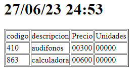

| Carnet    | Nombre                      | Auxiliar |
| --------- | --------------------------- | -------- |
| 202111835 | Ruben Alejandro Ralda Mejia | Ronald Marín

# Manual Técnico
El lenguaje ensamblador utilizado, es Microsoft Macro Assembler 6.11 y se ejecuta en la maquina virtual de DOSbox 0.74.

Las directivas que utiliza son:
``` asm
.RADIX 16
.STACK
```
## Segmento de datos
En esta parte se crean las variables, el orden de algunas es importante mantenerlas y son las siguentes:
``` asm
encabezado db
mensaje_menu_principal db
mensaje_menu_productos db
mensaje_menu_herra db
mensaje_menu_ventas db
saltos db
credenciales db
mensaje_correcto db
nombre_credenciales db
handle_crede dw
error db
no_existe db
mensaje_salida db
mensaje_borrado db
mensaje_agregado db
nueva_lin db
mensaje_codigo_error db
mensaje_desc_error db
prompt_code db
prompt_desc db
prompt_price db
prompt_units db
;; "ESTRUCTURA PRODUCTO"
cod_prod db    
cod_desc db
cod_price dw
cod_units dw
num_price db
num_units db
ceros db 
;; "ESTRUCTURA PRODUCTO temporal"
cod_prod_temp db
cod_desc_temp db
cod_price_temp dw
cod_units_temp dw
;;
cod_prod_imprimir db
cod_desc_imprimir db
;;
nombre_archivo_productos db
handle_prods dw 
;;; temps
codigo_buscado    db
puntero_temp     dw
puntero_temp_buscar     dw
;;
caracter_leido    db
buffer_entrada   db
numero db
contador_cinco db
mensaje_mostrar db
;; Ventas
cancelar_venta db
buffer_codigo
buffer_unidad db
mostrar_contador db
mensaje_separador_venta db
fuera_de_rango db
contador_diez db
nombre_archivo_ventas db
handle_ventas dw
; Estructura 10 item Venta
dia db
mes db
anio db
hora db
min db
codigo_venta_temp db
unidades_temp db
;
registro_venta db
monto_venta dw
;
mensaje_compra db
mensaje_no_hay_existencias db
mensaje_actualizado db
mensaje_monto db
;  herramientas
nombre_archivo_catalogo db
handle_catalogo      dw
nombre_archivo_alfabetico db
handle_alfabetico      dw
nombre_archivo_rep_ventas db
handle_rep_ventas      dw
nombre_archivo_existencias db
; catalogo
tam_encabezado_html    db
encabezado_html        db
tam_inicializacion_tabla   db
inicializacion_tabla   db
tam_cierre_tabla       db 
cierre_tabla           db     
tam_footer_html        db    
footer_html            db    
td_html                db  
tdc_html               db 
tr_html                db   
trc_html               db   
h1_html                db  
h1c_html                db  
separador db
separador_espacio db 
separador_dos_puntos db
posicion_fecha dw 0000
; abc
tam_inicializacion_tabla_abc   db 
inicializacion_tabla_abc   db 
conteo_abecedario db
conteo_letra db
conteo_letra_mostrar db
; productos
mensaje_ya_existe  db
; reporte ventas
separador_tipo_venta db
separador_venta db
salida_ultimas_ventas db
salida_venta_mayor db
salida_venta_menor db
salida_fecha db
salida_monto db
offset_venta dw
venta_mayor dw 
venta_menor dw 
;
dia_mayor db 
mes_mayor db 
anio_mayor db 
hora_mayor db 
min_mayor db 
;
dia_menor db 
mes_menor db 
anio_menor db
hora_menor db 
min_menor db 
;
mensaje_reporte db
```
## Segmento de código
### Login
Para verificar las credenciales, se abre el archivo luego se lee byte por byte y con la variable credenciales se pone el offset en el registro DI, y se incrementa por cada vez que lee. Se ignoran los bytes como salto, espacio, nueva linea etc. y se compara si son iguales, de cumplirse se incrementa DI y cuanto termina de leer el archivo se pregunta si llego a un byte de aceptación. Por último si se cumple salta a un ciclo esperando que se presiona la tecla ENTER. Las etiquetas para el login son:
``` asm
acceso:
ciclo_comprobar_credenciales:
quitar_saltos:
caracteres_faltantes:
esperando_enter:
```
### Menús
En el menú principal se utiliza un ciclo con un salto condicional, si se presiona las teclas con ASCII 70, 76, 68 y 73 saltará al menú correspondiente, productos, ventas, herramientas y salir de la aplicación, todos funcionan de la misma forma y de cumplirse salta a su porción de código correspondiente a la funcionalidad escogida. Las etiquetas son las siguientes:
``` asm
menu_principal:
menu_productos:
menu_ventas:
menu_herramientas:
```
### Ingresar producto
Etiquetas que se utilizan para marcar la funcionalidad de ingresar productos.
``` asm
mensaje_desc_invalido
mensaje_codigo_invalido
pedir_codigo
aceptar_tam_cod
copiar_codigo
pedir_descripcion
aceptar_tam_desc
copiar_desc
pedir_precio
aceptar_tam_precio
pedir_unidades
aceptar_tam_unidades
```
Después de obtener y comprobar los datos ingresados se procede a guardar en el archivo **PROD.BIN**. Para ello se comprueba si ya existe, leyendo 28h bytes y comparar con el código ingresado, si son iguales regresa a pedir_codigo, caso contrario comprueba si el código es nulo significando que previamente se elimino un producto y se dejo ese espacio disponible, si nada de eso ocurre lo guarda hasta el final.
``` asm
abrir_archivo_productos
crear_archivo_prod
guardar_handle_prod
ciclo_existe
poner_puntero_inicio
ciclo_espacio_disponible
espacio_a_ingresar
codigo_ya_existe
finalizar_ingreso
```
### Eliminar producto
Para eliminar un producto, se utiliza la misma lógica de pedir el código y se procede abrir el archivo, si no existe regresa. Con el archivo abierto, se lee 28h bytes y se compara con el código ingresado, si son iguales va rellenar de 28h bytes de 00 en la posición que se leyó el código.
``` asm
mensaje_codigo_invalido_eliminar
eliminar_producto
pedir_codigo_buscar
aceptar_codigo_buscar
copiar_codigo_encontrado
ciclo_encontrar
borrar_encontrado
no_encontrado_eliminar
finalizar_borrar
error_crear_antes_archivo
```
### Mostrar productos
Se comprueba que existe el archivo y se lee 28h bytes, luego se llama una subrutina para imprimir en pantalla el código y la descripción del producto.
``` asm
mostrar_productos
iniciar_contador
ciclo_mostrar
continuar_mostrando
fin_mostrar
```
### Ventas
Se convierte el monto de cada venta que empieza con 0000, usando la subrutina numAcadena y en la variable puntero se guarda la representación en caracteres del número, luego se hace lo mismo con el contador y se procede a pedir los datos y validar las entradas como se hizo en ingresar productos.

Con los datos ingresados, se comprueba que el código del producto representa datos en el archivo, de no ser así regresa a pedir el código sin incrementar el contador y mueve el puntero del archivo al inicio nuevamente para leer todo el archivo al momento de buscar un producto. Si existe entonces verifica si la unidades son menores a un byte (FFh) de cumplirse se guarda los datos necesarios de la venta en un espacio del segmento que ocupa 64h bytes que representa 10 items por venta y el monto total al final.

Si se confirma la venta, se escribe en el archivo los 64h bytes de la venta y luego para modificar las existencias en el archivo de productos, se mueve un puntero colocado al inicio de la primera venta y se extrae el código del producto para buscarlo en el archivo, ya encontrado, como antes se guardaban los 28h bytes en el segmento de datos, se restan las unidades y se mueve el puntero 28h bytes antes para volver a escribirlos pero con los cambios hechos. Esto lo hace hasta encontrar un byte con valor 00 en la variable de 64h o hasta que llegue el contador a 0 que se incrementó antes para mostrar al inicio. En cada ciclo se pone el puntero del archivo de productos al inicio nuevamente para buscar en todo el archivo.

``` asm
unidades_rango
mensaje_codigo_invalido_ventas
producto_no_existe
ventas
pedir_codigo1
comprobar_fin
copiar_codigo_venta
pedir_unidades1
validar_campos
ciclo_encontrar_codigo
mensaje_sin_existencias
guardar_item_venta
guardar_venta
copiar_item_temporal
confirmar_venta
abrir_archivo_ventas
crear_archivo_ventas
guardar_handle_ventas
abrir_archivo_productos_segunda
ciclo_actualizar_existencias
copiar_venta
ciclo_buscar_actualizar
actualizar_existencia
cancelar_compra
```
### Reporte catálogo
``` asm
catalogo_completo
poner_fecha
escribir_fecha
incrementar_posiones_fecha
poner_dos_puntos
poner_espacio_hora
poner_separador_fecha
poner_tabla
ciclo_mostrar_rep1
fin_mostrar_rep1
```
### Reporte alfabético
``` asm
productos_alfabeticos
poner_fecha1
escribir_fecha1
incrementar_posiones_fecha1
poner_dos_puntos1
poner_espacio_hora1
poner_separador_fecha1
poner_tabla1
ciclo_conteo_letras
incrementar_dependiendo_tipo
incrementar_como_minuscula
escribir_conteo_letras
cerrar_archivo_abc
```
### Reporte de ventas
``` asm
reporte_ventas
ciclo_ultimas_ventas
buscar_venta
ciclo_buscar_monto
punto_mayor
punto_menor
actualizar_mayor
guardar_fecha_mayor
actualizar_menor
guardar_fecha_menor
escribir_mayor_menor
cerrar_archivo_re_ventas
```
### Reporte sin existencias
``` asm
productos_sin_existencia
poner_fecha2
escribir_fecha2
incrementar_posiones_fecha2
poner_dos_puntos2
poner_espacio_hora2
poner_separador_fecha2
poner_tabla2
ciclo_mostrar_rep2
llamar_imprimir
fin_mostrar_rep2
```
## Sub rutinas
``` asm
;;; Entrada:
;;  AX -> montoventa
;; salidas:
;; escribe en archivo rep.txt
escribir_monto:
;;; Entrada:
;;  DI, -> registro_venta
;; salidas:
;; escribe en archivo rep.txt
poner_fecha_venta:
;; imprimir_estructura - ...
;; ENTRADAS:
;; SALIDAS:
;;     o Impresión de estructura
imprimir_estructura:
;; cadenaAnum
;; ENTRADA:
;;    DI -> dirección a una cadena numérica
;;    CX -> cantidad de digitos o bytes
;; SALIDA:
;;    AX -> número convertido
cadenaAnum:
;; numAcadena
;; ENTRADA:
;;     AX -> número a convertir    
;; SALIDA:
;;    [numero] -> numero convertido en cadena
numAcadena:
;; memset
;; ENTRADA:
;;    DI -> dirección de la cadena
;;    CX -> tamaño de la cadena
memset:
;; cadenas_iguales -
;; ENTRADA:
;;    SI -> dirección a cadena 1
;;    DI -> dirección a cadena 2
;;    CX -> tamaño máximo
;; SALIDA:
;;    DL -> 00 si no son iguales

;;         0ff si si lo son
cadenas_iguales:
;;; ENTRADA:
;;    BX -> handle
imprimir_estructura_html:
;;; ENTRADA:
;;    BX -> handle
imprimir_estructura_abc:
; ENTRADA
;; AL -> caracter
; SALIDA
;; AH -> 00 rechazado
;; AH -> 0FF aceptada
comprobar_caracter_codigo:
; ENTRADA
;; AL -> caracter
; SALIDA
;; AH -> 00 rechazado
;; AH -> 0FF aceptada
comprobar_caracter_descripcion:
```
# Manual de usuario
## Inicio de sesión
Tendremos que iniciar sesión con las credenciales previamente cargadas en el archivo **PRAII.CON**. Si el archivo no esta o son incorrectas, se procedera a salir de la aplicación, caso contrario se espera que presiona la tecla ENTER.


## Menú Principal
Tendremos en pantalla las opciones posibles a escoger, presionando la tecla con el caracter correspodiente a lo que esta dentro de los parentesís y si se presiona cualquier otra cargará el menú nuevamente.


## Menú productos
En este menú se podrá escoger con la misma dinamica que el menú anterior, las opciones ahí listadas.


### Ingreso de producto

Para el ingreso de productos, se pide un código, luego una descripción, el precio y las unidades de este, cuando se termine de ingresar los datos regresará al menú productos. Los productos se guardarán en en el archivo **PROD.BIN**, si no existe se crea.


### Eliminar un producto
Para borrar un producto de solo es necesario ingresar el código de este y se mostrará el mensaje que fue eliminado.


### Visualizar los productos
Esta opción muestra en pantalla en grupos de 5, los productos ingresados. Se muestra el código y la descripción y para ver la siguiente página se presiona la tecla ENTER o para finalizar la tecla q.


## Ventas
Si se tienen productos ingresados, es posible perder varias unidades. La venta se hace por 10 productos y se va calculando en pantalla el monto total, se pide el código y las unidades a vender. Para salir prematuramente se debe escribir la palabra fin.


Independiente de llenar los 10 items o terminar antes, se nos pedirá confirmar la venta. De confirmar se actualizarán las existencias en el archivo productos.


## Herramientas

En esta opción se nos desplegará un menú de los reportes que se pueden hacer. De igual forma para escoger una opción se hace como en las menus anteriores.


Después de escoger un reporte, se mostrá un mensaje indicando que ha terminado.

### Ejemplos de los reportes
En todos tendremos la fecha en la parte superior.

En el reporte de catalogo, se lista en una tabla los productos ingresados:


En el reporte alfabetico, se hace un conteo por la inicial de cada descripción de los productos.


En el reporte de productos sin existencias, de igual forma se hace un listado con la peculiariad de los productos que tiene 0 unidades.



Y por último, esta el reporte de ventas. Esta divido en 3 partes, en la primera se lista las ultimas 5 ventas, en la segunda la venta de mayor monto y la tercera la venta de menor monto.


